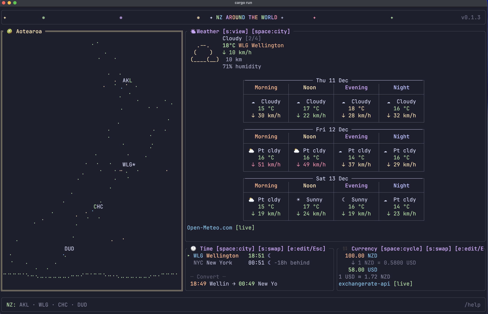

# nzi

A terminal dashboard with useful information for thinking about New Zealand and its place in the world: local weather, world clocks, and currency conversion. 



## Features

- **NZ Weather** - Current conditions and 3-day forecast for NZ cities (Auckland, Wellington, Christchurch, Dunedin) with wttr-style grid view
- **World Clocks** - Track time across Wellington and your home city (London, NYC, LA, Austin, Paris, Sydney, Tokyo, Singapore)
- **Currency Converter** - Live exchange rates between NZD and major currencies
- **Time Converter** - Convert times between NZ and overseas cities (Useful for arranging meetings)

Of course, you can get this information from a browser, but it's much nicer from the comfort of the terminal.

## Installation

### Install Rust (if you don't have it/ otherwise skip)


```bash
# macOS / Linux
curl --proto '=https' --tlsv1.2 -sSf https://sh.rustup.rs | sh

# then restart your terminal, or run:
source ~/.cargo/env
```

For Windows, download the installer from [rustup.rs](https://rustup.rs).


### Install using cargo

Once Rust is installed, you can install/update this application by running:

```bash
cargo install --git https://github.com/go-bayes/nzi-cli
```

## Usage

After installing, from your terminal just type `nzi` and then hit return/enter: the interface will spring forth to life.

Use it to

- Sketch an informal plan: travel/grants/communications (time zones)
- Retain a mental model of the weather for friends/family overseas.
- Imagine the life routines of others around the planet. 


```bash
# launch the dashboard
nzi

# show help overlay
`/h`

# leave help 
`Esc`

# quit interface/return to terminal 
`q`
```

## Keybindings

Type `/help` to show the help overlay.

### Navigation

| Key | Action |
|-----|--------|
| `Tab` / `↑↓←→` | Cycle between panels |
| `h/j/k/l` | Cycle between panels (vim-style) |
| `Esc` | Close help / cancel |
| `q` | Quit application |

### Panel Controls (depending on focus)


| Key | Action |
|-----|--------|
| `Space` | Cycle city/currency |
| `s` | Swap (time/currency) / toggle weather view |
| `e` | Edit (time/currency) |
| `0-9` | Direct entry (time in normal mode, amount in currency) |

### Slash Commands

| Command | Action |
|---------|--------|
| `/help` or `/h` | Show help overlay |
| `/edit` or `/e` | Edit config in $EDITOR |
| `/quit` or `/q` | Quit application |
| `/reload` (or `/r`) | Reload config from disk |

## Configuration

Configuration is stored in `~/.config/nzi-cli/config.toml` and is created automatically on first run.

Change the defaults to suit. `[home_city]` is the default overseas paired city.


```toml
[current_city]
name = "Wellington"
code = "WLG"
country = "New Zealand"
timezone = "Pacific/Auckland"
currency = "NZD"

[home_city]
name = "London"
code = "LDN"
country = "UK"
timezone = "Europe/London"
currency = "GBP"

[[tracked_cities]]
name = "New York"
code = "NYC"
country = "USA"
timezone = "America/New_York"
currency = "USD"

# ... more cities

[display]
show_seconds = true
use_24_hour = true
show_animations = true
animation_speed_ms = 100
# editor = "nvim"  # defaults to $EDITOR or nvim
```

## Data Sources

- **Weather**: [Open-Meteo](https://open-meteo.com/) (free, no API key required)
- **Exchange Rates**: [ExchangeRate-API](https://www.exchangerate-api.com/) (free tier)

## Default Cities (change configure to suit using `/edit`)

### NZ Cities (Weather)
Auckland, Wellington, Christchurch, Dunedin

### World Cities (Time/Currency)
London, New York, Los Angeles, Austin, Paris, Sydney, Tokyo, Singapore

## Requirements

- Terminal with Unicode support (for braille map and icons)
- Internet connection (for live weather and exchange rates

## Building from Source

```bash
git clone https://github.com/go-bayes/nzi-cli
cd nzi-cli
cargo build --release
./target/release/nzi
```

## Fine print

- This tool will not work unless data can be fetched from its data sources.
- The conversion is local -- you should not use the time converter for long range planning because day light savings will need to considered.


## Licence

MIT
