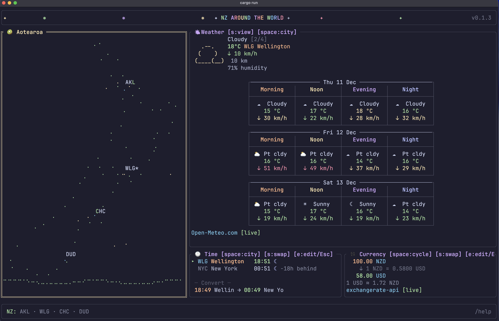

# nzi

A terminal dashboard for thinking about New Zealand and its place in the world, with NZ weather, an anchor city, target cities, aligned time and currency views, and an optional world map.



## Features

- **NZ Weather** - Current conditions and 3-day forecast for NZ cities (Auckland, Wellington, Christchurch, Dunedin) with wttr-style grid view
- **Places Model** - Choose one anchor city and an ordered list of target cities
- **World Clocks** - Track time across representative cities without managing separate timezone lists
- **Currency Converter** - Live exchange rates derived from the same target-city list used by time comparison
- **Time Converter** - Convert times from the anchor city to the current target city
- **Optional World Map** - Anchor-to-target routes with a map panel you can disable

Of course, you can get this information from a browser, but it's much nicer from the comfort of the terminal (just type 'nzi'). 

## Installation

### If you have Rust, install or update using cargo

Run this: 

```bash
cargo install --git https://github.com/go-bayes/nzi-cli
```

### Install Rust (one-time setup)

If you do not already have Rust, run this:

```bash
# macOS / Linux
curl --proto '=https' --tlsv1.2 -sSf https://sh.rustup.rs | sh

# then restart your terminal, or run:
source ~/.cargo/env
```

For Windows, download the installer from [rustup.rs](https://rustup.rs).

### Building from Source

```bash
git clone https://github.com/go-bayes/nzi-cli
cd nzi-cli
cargo build --release
./target/release/nzi
```
## Usage

After installing, from your terminal, type `nzi` and then hit return/enter: the interface will spring forth to life.

Use it to

- Sketch an informal plan: travel/grants/communications (time zones)
- Retain a mental model of the weather for friends/family overseas.
- Imagine the life routines of others around the planet. 

```bash
# launch the dashboard
nzi

# show help overlay
/h

# leave help 
Esc

# quit interface/return to terminal 
q
```

## Keybindings

Type `/help` to show the help overlay.

### Navigation

| Key | Action |
|-----|--------|
| `Tab` / `↑↓←→` | Cycle between panels |
| `h/j/k/l` | Cycle between panels (vim-style) |
| `Esc` | Close help / cancel |
| `q` | Quit application |

### Panel Controls (depending on focus)


| Key | Action |
|-----|--------|
| `Space` | Cycle weather city or current target |
| `s` | Swap current comparison / toggle weather view |
| `e` | Edit time input or FX amount |
| `0-9` | Direct entry (time in normal mode, amount in currency) |

### Config Editor

| Key | Action |
|-----|--------|
| `Tab` | Switch editor tabs |
| `j/k` | Move between rows |
| `J/K` | Reorder target cities |
| `Enter` | Activate selected row |
| `a` | Add target city |
| `x` | Remove selected target city |
| `Esc` | Close editor and keep draft open |

### Picker Controls

| Key | Action |
|-----|--------|
| `j/k` or `↑/↓` | Move through picker results |
| `Enter` | Select highlighted option |
| `Esc` | Close picker |

### Slash Commands

| Command | Action |
|---------|--------|
| `/help` or `/h` | Show help overlay |
| `/edit` or `/e` | Edit config in $EDITOR |
| `/config` | Open the staged config editor |
| `/quit` or `/q` | Quit application |
| `/reload` (or `/r`) | Reload config from disk |
| `/apply` | Apply the current config draft |
| `/discard` | Discard the current config draft |
| `/reset` | Reset the current draft to defaults |
| `/restore` | Restore the latest saved snapshot into the draft |
| `/country` or `/focus` | Open the focal-city-by-country picker |
| `/country <query>` | Set the focal city through country lookup |
| `/currency` | Open currency-to-place picker |
| `/currency <query>` | Add a place by currency via country |
| `/map` | Open the map visibility picker |
| `/map <on\|off>` | Show or hide the map |

The bare `/country`, `/currency`, and `/map` commands open interactive search overlays. `/config` opens the staged editor, whose `Places` tab now drives the main workflow: one anchor city, one ordered target-city list, optional map display, and country or currency helpers that resolve back to representative cities. The map no longer has an independent focal-country workflow in the editor.

## Configuration

Configuration is stored in `~/.config/nzi-cli/config.toml` and is created automatically on first run.

Change the defaults to suit. Older config sections still load, but the current product model is built around an anchor city and target cities. `currency` and `map` remain optional sections.


```toml
[current_city]
name = "Wellington"
code = "WLG"
country = "New Zealand"
timezone = "Pacific/Auckland"
currency = "NZD"

[home_city]
name = "London"
code = "LDN"
country = "United Kingdom"
timezone = "Europe/London"
currency = "GBP"

[[tracked_cities]]
name = "Boston"
code = "BOS"
country = "USA"
timezone = "America/New_York"
currency = "USD"

# ... more cities

[display]
show_seconds = true
use_24_hour = true
show_animations = true
animation_speed_ms = 100
# editor = "nvim"  # defaults to $EDITOR or nvim

[time]
anchor_city_code = "WLG"
target_city_codes = ["BOS", "LDN", "TYO"]

[map]
enabled = true
mode = "route"
# focal_country_code = "GBR"
# focus_city_code = "BOS"
# focus_country_codes = ["USA", "GBR"]
```

## Data Sources

- **Weather**: [Open-Meteo](https://open-meteo.com/) (free, no API key required)
- **Exchange Rates**: [ExchangeRate-API](https://www.exchangerate-api.com/) (free tier)

### Default Cities (change configure to suit using `/edit`)

### NZ Cities (Weather)
Auckland, Wellington, Christchurch, Dunedin

### World Cities (Time/Currency)
Representative cities drawn from the built-in catalogue, one per country and timezone combination where practical. By default this includes Boston, London, Los Angeles, Austin, Paris, Berlin, Sydney, Tokyo, Singapore, Kuala Lumpur, Rio, Addis Ababa, Dhaka, and Beijing.

## Requirements

- Internet connection (for live weather and exchange rates)

### Weaknesses

-  Time/DST handling uses chrono-tz for DST-aware conversion of entered times, but assumes "today" as the date. There is still no arbitrary-date selection.
-  Weather is explicitly NZ-only by design.
-  The city catalogue is curated and the picker only shows representative cities, so not every possible city is exposed.
-  Country and currency helper flows only work when there is a representative city already configured for that place.
-  Older `currency` config still loads for compatibility, but the current product model derives currency behaviour from anchor and target cities.

## Licence

MIT
